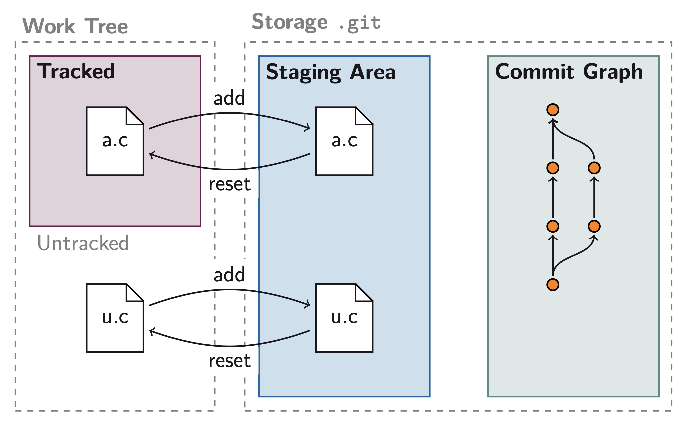
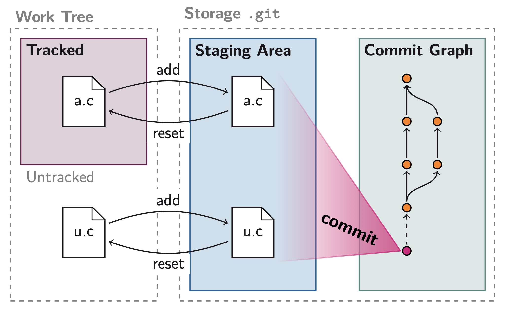
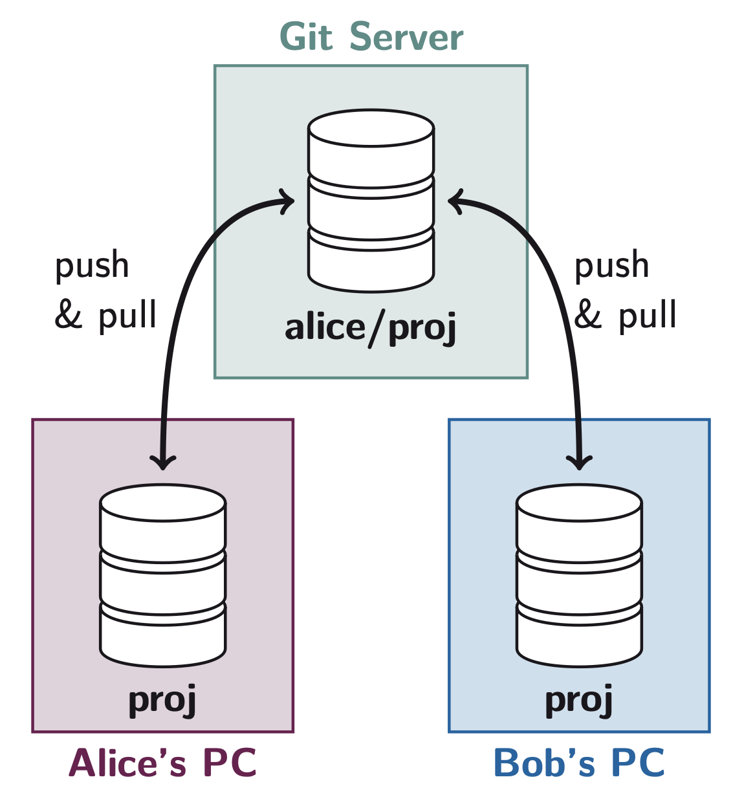
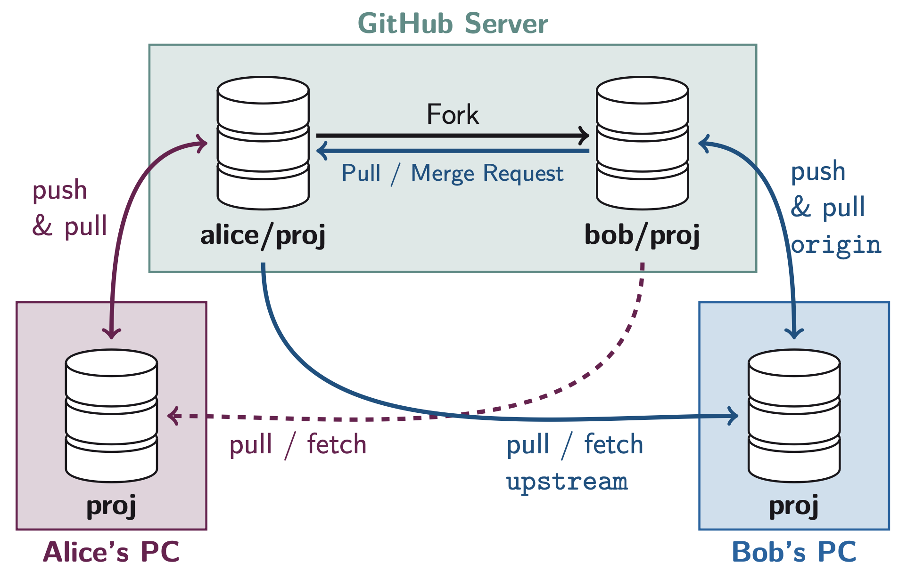

# Hands-on Phase Tutorial

### I do not have a Nobel in literature, but please **read every sentences**, I promise they are concise and necessary for understanding.

This tutorial will be a guide to reduce the pain of using the Git for the first time. This requires you to have at least another person to work with. The fictitious setup is to move an existing project into version control and further develop it with your friends / colleagues. We will use the command line interface in the terminal (or at least in the beginning).

<p align="center">
  
</p>

## Configure Git on your Machine

After having installed Git we first configure git. Open a terminal: Windows `Git Bash Here` (or Windows Terminal), MacOS `Terminal.app`, Linux: use your favourite. The first thing you have to do is tell Git your information

```sh
$ git config --global user.name "Your Name"            # Name shown in commits
$ git config --global user.email your_email@domain.ch  # E-Mail shown in commits
```

Next define a new command `git graph` to visualise the commit graph in the command line. We will use this command throughout the tutorial:

```sh
$ git config --global alias.graph "log --all --decorate --graph --oneline"
```

We set that we want that `git pull` is an alias for `git fetch` + `git merge` (it can also be configured to be `git fetch` + `git rebase`, more on this later):

```sh
$ git config --global pull.rebase false
```

Then the following commands to set some sane defaults, mostly taken from [this article](https://blog.gitbutler.com/how-git-core-devs-configure-git/) if you are interested in the details:

```sh
$ git config --global init.defaultBranch master # default branch is called master
$ git config --global diff.algorithm histogram  # improves output of git diff
$ git config --global fetch.prune true          # delete remote branches is they no longer exist
$ git config --global fetch.pruneTags true      # same for tags
$ git config --global fetch.all true            # always get all remote branches
```

Finally we set up a simple text editor to write the commit messages. Unless you have customised it differently during the installation the default editor is VIM, which is very powerful but not user friendly at all.

### Windows

For Windows we can use Notepad.

```sh
$ git config --global core.editor notepad
```

### MacOS

On MacOS this will set the editor to Text Edit

```sh
$ git config --global core.editor "open -e -W -n"
```

## Pick a Project

We provide the following sample projects for you to work with Git:

 - A Python application (Game) [`sample_game.zip`](./samples/sample_game.zip)
 - A LaTeX Document `sample_report.zip` (not available yet, sorry)

Pick one based on your skills and download the zip file.

> [!TIP]
> Each zip contains a `README.md` and a `TODO.md` (both are plain text files) with further information and things to do respectively. For example in the `README.md` of `sample_game.zip` there are instructions on how to run the game.

## 1. Moving Into Version Control

> [!NOTE]
> Only one person in the team must do this part. The others team members can read ahead and / or give instructions while enjoying their drink. Alternatively, all members can do this part, but then for the later parts, you will use only one person’s work to continue the tutorial.

### Get the Source and Intialize

  1. Unzip your chosen project somewhere. Hereinafter we will refer to the unzipped folder as your "project directory".
     
  2. Open a terminal in the directory of the project. To do so right click on the directory and then for Windows: `Git Bash Here`, MacOS: `Services > New Terminal at Folder`, Linux: you got this.

  3. Initialize a Git repository by running:
     
     ```sh
     $ git init  
     ```
     
     If you enable hidden files in Windows Explorer (`View > Hidden Items`) or Finder (`CMD + Shift + .`) you will see that it has created a `.git` directory.

     Then you can also see that Git has no commits and is not tracking anything (yet) by reading the output of the command:
    
     ```sh
     $ git status
     ```

### Move the Existing Code

Next, we need to add the existing files to Git. Before doing so it recommended to avoid adding useless files (e.g. temporary files generated by the OS such as `Thumbs.db` or `.DS_Store`), so we must tell Git to ignore such files:

  1. Create an empty text file in the project directory called `.gitignore` (yes, it must start with a dot).
  
  2. Go to [gitignore.io](https://gitignore.io) and in the box type what you are using, for example `Windows`, `MacOS`, `Linux`, `Python` or `LaTeX`, hit `Create` and copy the text generated by the website into the `.gitignore` file. Alternatively, you can also do this directly from the terminal:
  
     ```sh
     $ curl https://www.toptal.com/developers/gitignore/api/linux,macos,windows,python,latex > .gitignore
     ```
     
     You can also write your own (without the website), the syntax is not difficult to learn.

  3. Run in the terminal:

     ```sh
     $ git status
     ```
      
     You should see under `Untracked files:` a list of files in red that git is detecting are not part of the repository. Check that there are no useless files such as `Thumbs.db`, `.DS_Store`, `__pycache__`, `Report.aux`. You can see git tells you:

     > use "`git add <file>...`" to include in what will be committed

     

  4. Add the existing files or directories to the staging area using:

     ```sh
     $ git add .gitignore README.md TODO.md pyproject.toml snake # add all files
     ```

     Adding directories will recursively add all files within them. Alternatively a shorter command if you want to add all files at once is:
     
     ```sh
     $ git add --all
     ```

> [!CAUTION]
> Do not abuse the `--all` flag. In general you should always chose which files to add. By carelessly using `--all` in large projects you might accidentally add cryptographic secrets, files that are gigabytes in size, etc..

> [!WARNING]
> If you are using `sample_game.zip` and have ran the game, do not add the `venv` directory because it contains a lot of files that are not directly part of your project. If you have accidentally added it e.g. using `git add --all` (though this should not have happened if `.gitignore` was configured correctly) reset your staging area by running:
> ```sh
> $ git reset # remove everything from the staging area
> ```
> and then add the files again more carefully.

  5. Run again

     ```
     $ git status
     ```

     Now you will see the files have turned green, they are in the staging area and Git says `Changes to be committed:` above them.

  6. If the list of file looks good you can create your first commit with

     ```sh
     $ git commit
     ```

     

     This will open your editor of choice. You will see a summary of the changes, these will not be part of the commit since if you read you will see the message
     
     ```sh
     # Please enter the commit message for your changes. Lines starting
     # with '#' will be ignored, and an empty message aborts the commit.
     ```

     Above these you can add your commit message. In this case there is not much to say except, for example write: `Move project into version control`.

     You can save the file and close the editor. In the terminal you should see a summary

     ```
      [master (root-commit) 132f122] Move into version control
       7 files changed, 962 insertions(+)
       create mode 100644 .gitignore
       create mode 100644 README.md
       create mode 100644 TODO.md
       create mode 100644 pyproject.toml
       create mode 100644 snake/__main__.py
       create mode 100644 snake/game.py     
     ```

You have successfully created your first commit in the `master` branch (the default branch name used by Git).

## 2. Using Git Services to Collaborate

### Register and Authenticate to a Git Service

All members go to [GitHub](https://www.github.com) and register an account if they don’t have one yet. After that each user must configure their account such that they can authenticate their computer with GitHub. You will only need to perform this task once.

> [!NOTE]
> Git uses the SSH protocol which uses [public-key cryptography](https://en.wikipedia.org/wiki/Public-key_cryptography) to synchronise the repositories across computers. Git can also work with HTTPS authentication but then for security reasons GitHub requires you to use authentication tokens, which are annoying. We stick to SSH. 

If you have never used SSH or don’t have an SSH key pair you need to generate it:

  1. Run the following command **replacing the email address with yours** and follow the instructions on screen. You can press `ENTER` a few times to use the default settings.

     ```sh
     $ ssh-keygen -t ed25519 -C "your_email@example.com" # replace with your email
     ```

     This will generate an SSH key pair using [elliptic curve cryptography](https://andrea.corbellini.name/2015/05/17/elliptic-curve-cryptography-a-gentle-introduction/).


  2. Copy your public key. If you read the output of the previous command you will see where it was saved `Your public key has been saved in ...`. By default it will be in your home directory. To read your public key you can open the file with your editor or in the terminal run:
     
     ```sh
     $ cat ~/.ssh/id_ed25519.pub  # or wherever it was saved
     ```

  3. Copy **your public key** which should look something like this

     ```
     ssh-ed25519 AAAAC3NzaC1lZDI1NTE5AAAAIPLVAByZGT6xWM2kg7AeEkXbujOETnHdw2FOUx3/mpow your_email@example.com
     ```

  4. On your GitHub profile in the browser click your profile icon in the top right and go to `Settings > SSH and GPG Keys > New SSH Key` and paste your public key, leave the key type settings to an `Authentication Key`.

You will now be able to authenticate your computer with GitHub.

### Upload the Project to the Git server (Remote)

The person that has done all of the steps so far (in part 1) needs to create a remote repository on their GitHub profile.

> [!IMPORTANT]
> If multiple people did the first part decide on one person should do this part.

  1. Go to [github.com/new](https://github.com/new) and create a new repository. Set the name to `gitws25`. Leave it to public, do not pick any templates and hit `Create Repository`.
  
     After a while you will see the repository has been created on your profile. There will be instructions on the website on how to upload your code. We will follow the instruction under "**... or push an existing repository from the command line**". Before following the instructions make sure that in the blue shaded area you have selected SSH

  2. In your terminal you can add the remote with

     ```sh
     $ git remote add origin git@github.com:YOUR_USERNAME/gitws25.git # replace with your remote URL
     ```

     This will let Git know that there is a server named `origin` (name is local to your machine) at the GitHub URL. You can also call it something else, like `github` instead of `origin` (note that for the rest of this tutorial we will use `origin`, you can use a different name but you will need to update the commands accordingly). You can then check that Git has saved the remote by reading the output of
     ```sh
     $ git remote --verbose # show remote url
     ```

  4. Now we can push our first commit to `origin` with

     ```sh
     $ git push --set-upstream origin master
     ```

     The `--set-upstream` flag will set `origin` to be the default remote to push to. After setting this once you will be able to write just `git push`, and it will push to `origin`.

  5. Now, if you refresh the browser you should see that your file have been uploaded to GitHub.

## 3. Collaborate with Your Team

<p align="center">

</p>

### Cloning the project

The other members can finally do something. Hopefully they are not drunk yet. We will give them permission to make changes in your remote repository.

  1. For the person that had been leading so far: Add your other team members as collaborators by going to `Settings > Collaborators > Add People` and adding their GitHub usernames.
  
  2. The other members can see on their email inbox or at [github.com/notifications](https://github.com/notifications) an invitation to join the project. Accept the invitation.
  
  3. The other members can clone the project onto their machines. Open terminal where you want your project to go. In the browser from the green `Code` button under SSH you can get the URL to clone the repository with the command:

     ```sh
     $ git clone git@github.com:YOUR_TEAM_MEMBER/gitws25.git # replace with your remote URL
     ```

### Fast-forward merge

> [!TIP]
> [Click here](https://raw.githubusercontent.com/HSR-Stud/Git-Workshop/master/slides/slides.pdf) to open the slides if you forgot what is a fast-forward merge. The explanation was in the subsection *Merging Strategies*.

We will finally start to do something interesting with the Git commit graph. First we do a fast-forward merge, we need two people **Alice** and **Bob**. You can choose who plays which character. To make it interesting for the group, we will work with remote branches, even though the theory is the same for local branches.

  1. **Alice:** In the project folder there is a file `TODO.md` with a list of things to do, pick any task you like and perform the change in the project code. After saving the files you can see your changes (in red) under `Changes not staged for commit: ...` in the output of

     ```sh
     alice $ git status 
     ```

     You can quickly add the files you have changed with the staging area using the `--update` flag:

     ```sh
     alice $ git add --update # add all files that are tracked
     ```

     Commit your changes with an appropriate commit message, and push your changes to the remote repository (GitHub). The `--verbose` will allow you to see the changes in the editor for the commit message:

     ```sh
     alice $ git commit --verbose
     alice $ git graph # see your new commit. or git log if you do not have the alias
     alice $ git push origin master
     ```

>[!TIP]
> If you have used the `--set-upstream` flag earlier, you can just write `$ git push` instead of repeating always `$ git push origin master`.

  2. **Bob:** Fetch Alice’s changes and take a look at the commit graph before merging. You have no local changes, only the ones from remote. You only need to “catch up”:
     
     ```sh
     bob $ git fetch origin         # download new commits from remote
     bob $ git graph                # take a look at the commit graph
     bob $ git merge origin/master  # merge the remote changes into your local master branch
     ```

     If you read the output of the last command, it will say that is was a fast-forward merge. Now the two computers are in sync. If you are team of 3, for this part there can be “two Bobs”, i.e. two people can play the role of Bob.

### True Merge (3-way-merge)

You should be starting to get how this work, so we will give less detailed instruction from now on. We will now perform a true merge (aka 3-way-merge).

  1. **Alice and Bob:** Pick any task from `TODO.md` and do it. Pick different tasks. Add your changes to the staging area and commit

     ```sh
     $ git add ... # add the files you changes
     $ git commit  # with a good commit message
     ```

  2. **Alice:** Upload your changes to the remote repository

     ```sh
     alice $ git push origin master
     ```

>[!TIP]
> If you struggle visualising what is happening in your head. Take a piece of paper and draw the commit graphs on each machine, as was done in the presentation slides.
>

>[!IMPORTANT]
> **Bob:** Make sure the are no uncommitted (unsaved) changes by running:
> ```sh
> $ git status # check that you have no modified files
> ```
> otherwise the merge will fail, telling you that it would overwrite your unsaved changes. If you have some changes by mistake, you can discard (delete) them using
> ```sh
> $ git restore FILE # DELETES your changes in file!
> ```

  3. **Bob:** Download Alice’s changes and observe that your commit graph has a branching commit (histories diverge)

     ```sh
     bob $ git fetch origin        # get changes from remote
     bob $ git graph               # observe that histories diverge
     bob $ git merge origin/master # merge the their (alice's) changes
     ```

     After running the last command, the editor will pop up, because to perform this merge you need to create a new commit, with a commit message. You can leave the default `Merge branch origin/master into master`, save it and close. You should now have both your and Alice’s changes.

  4. **Bob:** Push the newly created merge commit to the remote `origin`

     ```sh
     bob $ git push origin master # push merge commit
     ```

  5. **Alice:** Download Bob’s merge commit and do a fast-forward merge

     ```sh
     alice $ git fetch origin.        # download bob's merge commit
     alice $ git merge origin/master  # will be a ff-merge
     ```

     Or in one command:

     ```sh
     alice $ git pull origin # fetch and merge
     ```

     Now the two computers should be in sync. If there are other team members, they can also pull from origin to sync their repository.

>[!IMPORTANT]
> Now we will repeat the same process, but we will also intentionally cause a merge conflict, so that you can learn how to deal with them. You can switch roles if you want.

  6. **Alice and Bob:** Pick the *same* task from `TODO.md` and edit the same file at exactly same lines, but make sure they are different on each machine. Add your changes and commit them. Make sure you do not have uncommitted changes using `$ git status`.

  7. **Alice:** Push your changes to the remote.

  8. **Bob**: Fetch the changes and merge, or do both at once using pull. You will get an error message. Git will tell you that there was a merge conflict, it should also tell you in which file it happened. If you run in the terminal:

     ```sh
     bob $ git status
     ```

     You will see that you are in the middle of a merge, Git will say `You have unmerged paths.`, and it will also tell you which files caused the merge conflict under `Unmerged paths:`. Now, if you open the editor and take a look at the file(s) with the merge conflict you will find something like this:

     ```
     <<<<<<< HEAD
     Your local changes (Bob's)
     =======
     Remote changes (Alice's)
     >>>>>>> 75d041...
     ```

     Git has added `=======` where the conflict happened, on one side you should have your changes, while on the other Alice’s.

  10. **Bob:** To manually resolve the conflict. You need to choose one of the changes (for this tutorial it does not matter which one), then delete the other changes you do not want, the line `=======`, as well as the other two lines with `<<<<<<<` and `>>>>>>>`, and save the file. Then you can continue the merge that had failed by completing the merge commit:

      ```sh
      bob $ git add ... # add files that caused conflict, and have been fixed
      bob $ git commit --verbose
      bob $ git graph # take a look at the commit graph
      ```
      
>[!TIP]
> It is good to resolve a merge conflict by hand at leat once as learning experience. For actual work though, there are many graphical tools that show you the two options and do the deleting automatically for you (though usually not adding and committing in Git). See slide *Graphical User Interfaces*.

  10. **Bob:** Push your changes to remote

  11. **Alice:** Fetch and merge (pull) Bob’s changes. The two machines should be in sync. 

### Rebase

We will now repeat this process again but instead of merging we will use rebase. This is typical if you work in a team that [wants to have a linear history](https://www.endoflineblog.com/oneflow-a-git-branching-model-and-workflow) or simplify pull requests (more on them later). To make it more interesting we will also start to use local branches.

  1. **Alice:** Pick any task from `TODO.md` and do it. Add your changes to the staging area and commit:
     ```sh
     alice $ git add ... # add the files you changes
     alice $ git commit  # with a good commit message
     ```
     **Bob:** Do the same but a different branch named `feature`. To create a new local branch from your local `master` branch run:
     
     ```sh
     bob $ git branch feature master # create a new branch feature from master
     bob $ git switch feature        # move your HEAD to feature
     ```
     
     Then pick a different task from Alice (to avoid conflicts for now), make your changes and commit them

     ```sh
     bob $ git add ... # add the files you changed
     bob $ git commit  # commit with a good message
     ```
     
  3. **Alice:** Upload your changes to the remote repository

     ```sh
     alice $ git push origin master
     ```

  4. **Bob:** Fetch alice’s change and rebase your changes on top

     ```sh
     bob $ git fetch origin          # get alice's commit
     bob $ git graph                 # observe the histories diverge
     bob $ git rebase origin/master  # rebase your change after alice's
     bob $ git graph                 # history is now linear
     ```

> [!TIP]
> If you like this better than the merge, you can change the settings to have `git pull` be `git fetch` + `git rebase` by running the following command:
> ```sh
> $ git config --global pull.rebase true # use rebase instead of merge
> ```

## Install a Graphical Interface to Git

Now that you have gone through the pain of understanding Git at its lowest level using the command line, you may optionally install a graphical interface that hides away all of these details. I suggest [Sublime Merge](https://www.sublimemerge.com/).

## 4. Collaborate with other Teams



### Contributing with Forks and Pull-Requests

We will now consider the scenario where you want to add your changes to a repository to which you do not have the right to write.

  1. One person in the team, [click here](https://www.github.com/naopross/gitws_snake) to see my (Naoki's) repository of the game. You cannot upload to this repository.
  
  2. On the top right of the page click on the fork button, and create the fork. This will create a new remote repository on your profile.
  
  3. Again add your other team members to the fork repository by going to `Settings > Collaborators > Add People`. The others can accept the invite.

  4. Clone your forked repository, make some changes, commit them and push them to your repository.

  5. On the web browser after refreshing the page you should see a new button `Contribute`. Click on it and follow its instructions to create a pull request on my repository.
  
  6. Add my repository as remote in your local computer to be able to see what me (Naoki) and the other groups are doing in my project, we will call this remote `upstream`. To do so run:
  
     ```sh
     $ git remote add upstream https://github.com/NaoPross/gitws_snake.git
     $ git fetch upstream   # fetch the change in upstream
     $ git graph            # take a look at other people's changes
     ```
     Notice that we are using HTTPS, since you are not allowed to directly authenticate to  NaoPross's repository.

> [!NOTE]
> You now have two remotes, yours and mine (Naoki's). You will push and pull to `origin` to work with your team members, and you will fetch from `upstream` to get mine and other team's changes (that will be merged through pull requests).
> <p align="center">
>   
> </p>

